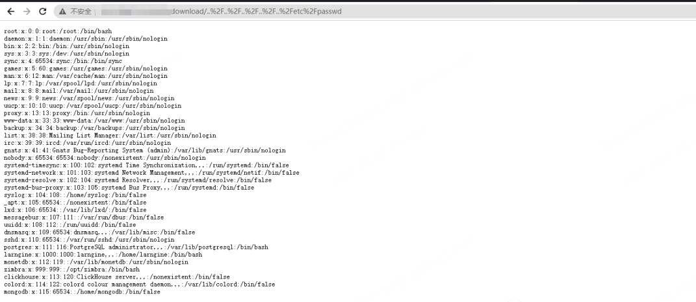

# T1190-CVE-2023-35843 NocoDB任意文件读取

## 来自ATT&CK的描述

使用软件，数据或命令来利用面向Internet的计算机系统或程序中的弱点，从而导致意外或无法预期的行为。系统的弱点可能是错误、故障或设计漏洞。这些应用程序通常是网站，但是可以包括数据库（例如SQL），标准服务（例如SMB 或SSH）以及具有Internet可访问开放的任何其他应用程序，例如Web服务器和相关服务。根据所利用的缺陷，这可能包括“利用防御防卫”。

如果应用程序托管在基于云的基础架构上，则对其进行利用可能会导致基础实际应用受到损害。这可以使攻击者获得访问云API或利用弱身份和访问管理策略的路径。

对于网站和数据库，OWASP排名前10位和CWE排名前25位突出了最常见的基于Web的漏洞。

## 测试案例

NocoDB在0.106.0（或 0.109.1）存在路径遍历漏洞，允许未经身份验证的攻击者通过操纵download路由的路径参数来访问服务器上的任意文件。此漏洞可能允许攻击者访问服务器上的敏感文件和数据，包括配置文件、源代码和其他敏感信息。

影响版本: NocoDB <= 0.106.1

空间测绘语句：title="NocoDB"

参考链接：

- <https://github.com/b3nguang/CVE-2023-35843>
- <https://blog.csdn.net/m0_46317063/article/details/131450318>
- <https://www.wevul.com/1701.html>

## 检测日志

HTTP.log

## 测试复现

paylaod

```
/download/..%2F..%2F..%2F..%2F..%2Fetc%2Fpasswd
```

测试过程来自网络，未经实际测试：



## 测试留痕

无，未经实际测试，无留痕文件及PCAP流量包信息。

## 检测规则/思路

研判分析要点：

- 结合流量上下文，URL路径，请求方法
- 读取文件和文件信息
